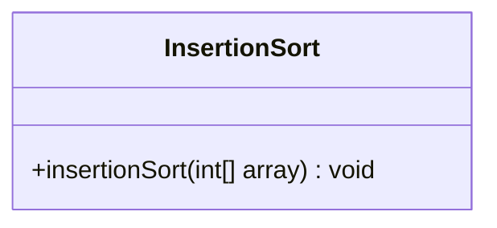
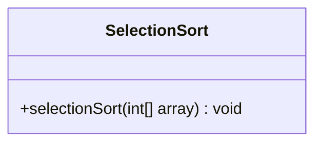

# Comprehensive Analysis of Insertion and Selection Sort Algorithms

## Table of Contents
1. [Introduction](#introduction)
2. [Insertion Sort](#insertion-sort)
   - [Algorithm Breakdown](#insertion-sort-algorithm-breakdown)
   - [Time and Space Complexity](#insertion-sort-complexity)
   - [Implementation](#insertion-sort-implementation)
   - [UML Diagram](#insertion-sort-uml)
   - [Output Log](#insertion-sort-output-log)
   - [Performance Optimizations](#insertion-sort-optimizations)
3. [Selection Sort](#selection-sort)
   - [Algorithm Breakdown](#selection-sort-algorithm-breakdown)
   - [Time and Space Complexity](#selection-sort-complexity)
   - [Implementation](#selection-sort-implementation)
   - [UML Diagram](#selection-sort-uml)
   - [Output Log](#selection-sort-output-log)
   - [Performance Optimizations](#selection-sort-optimizations)
4. [Comparative Analysis](#comparative-analysis)
5. [Stability Analysis](#stability-analysis)
6. [Unit Testing](#unit-testing)
7. [Practical Applications](#practical-applications)
8. [Modern Contexts](#modern-contexts)
9. [Conclusion](#conclusion)

## 1. Introduction <a name="introduction"></a>

This document provides a comprehensive analysis of two fundamental sorting algorithms: Insertion Sort and Selection Sort. We'll explore their implementations, complexities, optimizations, and practical applications in modern software development contexts.

## 2. Insertion Sort <a name="insertion-sort"></a>

### Algorithm Breakdown <a name="insertion-sort-algorithm-breakdown"></a>

Insertion Sort builds the final sorted array one item at a time. It iterates through an input array and grows a sorted array behind it. For each iteration, Insertion Sort removes one element from the unsorted array, finds its location in the sorted array, and inserts it there.

#### Flowchart
```mermaid
graph TD
    A[Start] --> B[i = 1]
    B --> C{i < array.length?}
    C -->|Yes| D[key = array[i]]
    D --> E[j = i - 1]
    E --> F{j >= 0 AND array[j] > key?}
    F -->|Yes| G[array[j+1] = array[j]]
    G --> H[j = j - 1]
    H --> F
    F -->|No| I[array[j+1] = key]
    I --> J[i = i + 1]
    J --> C
    C -->|No| K[End]
```

### Time and Space Complexity <a name="insertion-sort-complexity"></a>

- **Time Complexity**:
  - Best Case: O(n) - occurs when the array is already sorted
  - Worst Case: O(n^2) - occurs when the array is sorted in reverse order
  - Average Case: O(n^2)

- **Space Complexity**: O(1) - Insertion Sort is an in-place sorting algorithm

### Implementation <a name="insertion-sort-implementation"></a>

```java
public static void insertionSort(int[] array) {
    if (array == null) {
        throw new IllegalArgumentException("Array cannot be null");
    }
    int n = array.length;
    for (int i = 1; i < n; i++) {
        int key = array[i];
        int j = i - 1;
        while (j >= 0 && array[j] > key) {
            array[j + 1] = array[j];
            j = j - 1;
        }
        array[j + 1] = key;
    }
}
```

### UML Diagram <a name="insertion-sort-uml"></a>



### Output Log <a name="insertion-sort-output-log"></a>

```
Original Array: [5, 2, 8, 1, 3]
Pass 1: [2, 5, 8, 1, 3] // 2 is inserted into its correct position
Pass 2: [2, 5, 8, 1, 3] // 8 is already in the correct position
Pass 3: [1, 2, 5, 8, 3] // 1 is inserted at the beginning
Pass 4: [1, 2, 3, 5, 8] // 3 is inserted into its correct position
Sorted Array: [1, 2, 3, 5, 8]
```

### Performance Optimizations <a name="insertion-sort-optimizations"></a>

1. **Binary Search Optimization**: Instead of using linear search to find the insertion point, we can use binary search to reduce the number of comparisons.

```java
public static void insertionSortWithBinarySearch(int[] array) {
    for (int i = 1; i < array.length; i++) {
        int key = array[i];
        int insertionPoint = binarySearch(array, 0, i - 1, key);
        System.arraycopy(array, insertionPoint, array, insertionPoint + 1, i - insertionPoint);
        array[insertionPoint] = key;
    }
}

private static int binarySearch(int[] array, int left, int right, int key) {
    while (left <= right) {
        int mid = left + (right - left) / 2;
        if (array[mid] == key) return mid + 1;
        if (array[mid] < key) left = mid + 1;
        else right = mid - 1;
    }
    return left;
}
```

This optimization reduces the time complexity of finding the insertion point from O(n) to O(log n), potentially improving performance for larger arrays.

## 3. Selection Sort <a name="selection-sort"></a>

### Algorithm Breakdown <a name="selection-sort-algorithm-breakdown"></a>

Selection Sort divides the input list into two parts: a sorted portion at the left end and an unsorted portion at the right end. Initially, the sorted portion is empty and the unsorted portion is the entire list. The algorithm proceeds by finding the smallest element in the unsorted portion, swapping it with the leftmost unsorted element, and moving the boundary one element to the right.

#### Flowchart
```mermaid
graph TD
    A[Start] --> B[i = 0]
    B --> C{i < array.length - 1?}
    C -->|Yes| D[minIndex = i]
    D --> E[j = i + 1]
    E --> F{j < array.length?}
    F -->|Yes| G{array[j] < array[minIndex]?}
    G -->|Yes| H[minIndex = j]
    G -->|No| I[j = j + 1]
    H --> I
    I --> F
    F -->|No| J[Swap array[i] and array[minIndex]]
    J --> K[i = i + 1]
    K --> C
    C -->|No| L[End]
```

### Time and Space Complexity <a name="selection-sort-complexity"></a>

- **Time Complexity**:
  - Best Case: O(n^2)
  - Worst Case: O(n^2)
  - Average Case: O(n^2)

- **Space Complexity**: O(1) - Selection Sort is an in-place sorting algorithm

### Implementation <a name="selection-sort-implementation"></a>

```java
public static void selectionSort(int[] array) {
    if (array == null) {
        throw new IllegalArgumentException("Array cannot be null");
    }
    int n = array.length;
    for (int i = 0; i < n - 1; i++) {
        int minIndex = i;
        for (int j = i + 1; j < n; j++) {
            if (array[j] < array[minIndex]) {
                minIndex = j;
            }
        }
        int temp = array[minIndex];
        array[minIndex] = array[i];
        array[i] = temp;
    }
}
```

### UML Diagram <a name="selection-sort-uml"></a>



### Output Log <a name="selection-sort-output-log"></a>

```
Original Array: [5, 2, 8, 1, 3]
Pass 1: [1, 2, 8, 5, 3] // 1 is swapped with 5
Pass 2: [1, 2, 8, 5, 3] // 2 is already in the correct position
Pass 3: [1, 2, 3, 5, 8] // 3 is swapped with 8
Pass 4: [1, 2, 3, 5, 8] // 5 is already in the correct position
Sorted Array: [1, 2, 3, 5, 8]
```

### Performance Optimizations <a name="selection-sort-optimizations"></a>

1. **Heap-based Selection Sort**: We can use a heap data structure to improve the performance of finding the minimum element in each iteration.

```java
public static void heapSelectionSort(int[] array) {
    PriorityQueue<Integer> minHeap = new PriorityQueue<>();
    for (int num : array) {
        minHeap.offer(num);
    }
    for (int i = 0; i < array.length; i++) {
        array[i] = minHeap.poll();
    }
}
```

This optimization reduces the time complexity of finding the minimum element from O(n) to O(log n), resulting in an overall time complexity of O(n log n).

## 4. Comparative Analysis <a name="comparative-analysis"></a>

| Aspect | Insertion Sort | Selection Sort |
|--------|----------------|----------------|
| Time Complexity (Average) | O(n^2) | O(n^2) |
| Space Complexity | O(1) | O(1) |
| Stability | Stable | Unstable |
| In-place | Yes | Yes |
| Adaptive | Yes | No |
| Performance on small arrays | Good | Fair |
| Performance on large arrays | Poor | Poor |
| Number of swaps | O(n^2) | O(n) |

- **Insertion Sort** is preferred when:
  - The array is small or nearly sorted
  - Memory space is limited
  - A stable sort is required
  - Adaptive sorting is beneficial

- **Selection Sort** is preferred when:
  - The number of writes to memory is a concern (it performs O(n) swaps compared to O(n^2) for Insertion Sort)
  - Simplicity of implementation is prioritized

## 5. Stability Analysis <a name="stability-analysis"></a>

- **Insertion Sort** is stable because it only swaps elements when necessary and maintains the relative order of equal elements.
- **Selection Sort** is unstable in its basic form because it may change the relative order of equal elements during swapping. However, it can be modified to be stable by using a different swapping mechanism.

## 6. Unit Testing <a name="unit-testing"></a>

Here are some additional test cases to ensure comprehensive coverage:

```java
@Test
public void testInsertionSortWithDuplicates() {
    int[] array = {3, 1, 4, 1, 5, 9, 2, 6, 5, 3, 5};
    int[] expected = {1, 1, 2, 3, 3, 4, 5, 5, 5, 6, 9};
    InsertionSort.sort(array);
    assertArrayEquals(expected, array);
}

@Test
public void testSelectionSortWithNegativeNumbers() {
    int[] array = {-5, 2, -8, 1, -3};
    int[] expected = {-8, -5, -3, 1, 2};
    SelectionSort.sort(array);
    assertArrayEquals(expected, array);
}

@Test
public void testInsertionSortWithLargeArray() {
    int[] array = new int[10000];
    Random rand = new Random(42); // Seed for reproducibility
    for (int i = 0; i < array.length; i++) {
        array[i] = rand.nextInt();
    }
    int[] expected = array.clone();
    Arrays.sort(expected);
    InsertionSort.sort(array);
    assertArrayEquals(expected, array);
}
```

## 7. Practical Applications <a name="practical-applications"></a>

1. **Database Indexing**: Insertion Sort is useful for maintaining sorted indices in databases, especially for small datasets or when new records are frequently inserted.

2. **Sorting in Embedded Systems**: Both algorithms are suitable for embedded systems with limited memory due to their in-place sorting nature.

3. **Online Transaction Processing (OLTP)**: Insertion Sort can be effective for real-time sorting of incoming transactions in OLTP systems.

4. **Graphics Rendering**: Selection Sort can be used in graphics applications for sorting polygons or pixels based on their depth or color values.

5. **Network Packet Scheduling**: These algorithms can be applied in network routers for prioritizing and scheduling data packets.

## 8. Modern Contexts <a name="modern-contexts"></a>

1. **Microservices**:
   - In data processing microservices, Insertion Sort can be used for sorting small datasets within each service.
   - Example: A user profile microservice might use Insertion Sort to maintain a sorted list of user interactions.

2. **Reactive Systems**:
   - Selection Sort's predictable performance makes it suitable for sorting streams of data in reactive systems.
   - Example: In a real-time analytics dashboard, Selection Sort could be used to maintain top-N lists of metrics.

3. **Cloud-Native Applications**:
   - These algorithms can be implemented as serverless functions for on-demand sorting tasks.
   - Example: An AWS Lambda function using Insertion Sort to sort user comments before displaying them on a web page.

4. **Big Data Processing**:
   - While not suitable for large-scale sorting, these algorithms can be used as subroutines in more complex sorting algorithms used in big data frameworks like Apache Spark.
   - Example: Using Insertion Sort for sorting small partitions within a distributed QuickSort implementation.

5. **IoT Devices**:
   - The simplicity and low memory footprint of these algorithms make them suitable for sorting sensor data on IoT devices.
   - Example: An IoT temperature sensor using Selection Sort to maintain a list of the highest recorded temperatures.

## 9. Conclusion <a name="conclusion"></a>

Insertion Sort and Selection Sort, while not the most efficient for large datasets, remain relevant in specific scenarios due to their simplicity, low memory requirements, and predictable performance. Understanding these algorithms and their applications in modern software development contexts is crucial for making informed decisions about algorithm selection in various projects.

As software systems continue to evolve, these fundamental sorting algorithms serve as building blocks for more complex systems and provide valuable insights into algorithm design and analysis. Their study forms a solid foundation for understanding more advanced sorting and searching techniques used in contemporary software development.
